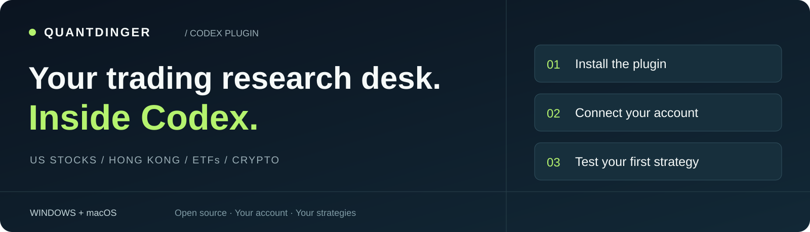

<p align="center"><a href="README.md">English</a> · <a href="README.zh-CN.md">简体中文</a> · <a href="https://ai.quantdinger.com">Open QuantDinger ↗</a></p>



<p align="center">
  <a href="https://github.com/OpenByteInc/QuantDinger_Codex_Plugin/actions/workflows/validate.yml"></a>
  <a href="LICENSE"></a>
  
  
</p>

**Describe your trading idea. Build the rules. See what the historical data says.**

Research **US stocks, Hong Kong stocks, ETFs and crypto**, build strategies, save backtests and inspect your accounts — all from a Codex conversation connected to your own QuantDinger account.

**[Install](#1-install)** · **[Connect](#2-connect-your-account)** · **[First backtest](#3-run-your-first-backtest)** · **[Detailed guide](docs/INSTALL.md)**

## 1. Install

You need a plugin-capable Codex client, Git, and a terminal where `codex --version` works. If the command is missing, install the [Codex CLI](https://developers.openai.com/codex/cli). Choose **one** platform:

### Windows · PowerShell

```powershell
codex plugin marketplace add OpenByteInc/QuantDinger_Codex_Plugin
codex plugin add quantdinger@quantdinger
```

Windows 10/11 x64. Python and dependencies are bundled and extracted locally. **No Python installation needed.**

### Mac · Terminal

Install `uv` once with its [official installer](https://docs.astral.sh/uv/getting-started/installation/) (skip if installed):

```bash
curl -LsSf https://astral.sh/uv/install.sh | sh
```

Then install the Mac plugin:

```bash
codex plugin marketplace add OpenByteInc/QuantDinger_Codex_Plugin
codex plugin add quantdinger-macos@quantdinger
```

Supports **Apple Silicon Macs (M series)**. Intel Macs are not supported in this release. First launch downloads managed Python 3.13 and hash-locked dependencies into an isolated user environment. **Stay online and allow the initial setup to finish.** Later launches reuse the environment.

> **Installed?** Open a **new Codex task**, type `@`, and select **QuantDinger** (Windows) or **QuantDinger for Mac**. You can also open its details and click **Try now**.


<sub>Real Windows capture supplied by the maintainer. Click Try now at the top right, or choose a prompt. This capture predates the shorter title and Mac entry in 0.2.0; your client's labels may differ.</sub>

## 2. Connect your account

1. Sign in to [QuantDinger](https://ai.quantdinger.com).
2. Open **[Profile → Agent Tokens](https://ai.quantdinger.com/#/profile?tab=agentTokens)** and issue a scoped token. Start with paper-only permissions.
3. In your plugin-enabled task, send: **“Connect my QuantDinger account and verify my permissions. Do not place any orders.”**
4. Supply the token when prompted. Check the returned **endpoint, permissions and paper-only status**.

**Success looks like:** `connected`, with a verified account and permissions. Continue in the same conversation. Connecting does not start trading.

On Mac, a Keychain prompt may appear. Confirm it belongs to the QuantDinger runtime you just installed. The token's local copy lives in the OS vault; tokens entered in chat also remain in chat/tool history. Prefer a [masked terminal prompt](docs/INSTALL.md#keep-your-token-out-of-chat) if you want to avoid that.

## 3. Run your first backtest

Copy this into the same task:

```text
Build an NVDA MA20/MA60 crossover strategy and backtest the last 90 days.
Use 10,000 initial capital, 0.1% fees and 0.05% slippage.
Save the result. Return its runId, actual data dates, return,
maximum drawdown, completed trades and any remaining position.
Do not deploy or start trading.
```

Codex checks and saves the strategy, submits the backtest, waits for completion, and explains the results. The **`runId`** identifies the standard saved record in QuantDinger. Check the actual date range, costs, closed trades and open positions together; some periods legitimately produce no closed trades.

| Explore next | Try asking |
| --- | --- |
| **Hong Kong · Tencent** | Analyze 0700.HK over 90 days: trend, volume and historical drawdown. Show the data dates. |
| **ETF · SPY** | Compare moving-average and RSI strategies with identical dates, capital, fees and slippage. |
| **Crypto · BTC/USDT** | Backtest RSI entries with a trend filter, 2% stop, 3% take profit and a maximum holding period. Inspect completed trades. |
| **Portfolio · Read only** | Show my paper-account positions, strategy fills and pending orders. Explain issues without changing anything. |

## One workflow, from research to operations

| Research | Build & test | Monitor & operate |
| --- | --- | --- |
| Symbols, quotes, historical bars | Strategy API V2 code | Account and strategy positions |
| Volume, factors, universes | Compilation and source versions | Fills, orders, runtime state |
| US / HK / ETF / crypto | Saved backtests and cost comparisons | Scoped, explicitly confirmed actions |

```text
Your Codex → Local QuantDinger plugin → Your QuantDinger backend
```

**[Installation, self-hosting, updates & troubleshooting →](docs/INSTALL.md)** · **[Report an issue →](https://github.com/OpenByteInc/QuantDinger_Codex_Plugin/issues)**

<details>
<summary>Costs, data and permissions</summary>

- The plugin is open source; hosted operations may consume QuantDinger credits. Codex usage is separate.
- The assistant assembles research from tools. No separate native AI report-generation tool is exposed in this release.
- Historical data may intentionally exclude the latest day for timezone/provider availability reasons. Compare actual returned dates.
- Supported markets and actions depend on the backend and account permissions. Connecting does not authorize trading.
- Uninstalling does not stop server-side strategies or revoke tokens.
- GitHub distribution is separate from OpenAI's public directory and is not an endorsement. Historical results do not guarantee future performance. See [security and data handling](SECURITY.md).

</details>

---

[Build & test](BUILDING.md) · [Contribute](CONTRIBUTING.md) · [Changelog](CHANGELOG.md) · [Apache-2.0](LICENSE) · [Third-party notices](NOTICE) · [Backend & MCP source](https://github.com/OpenByteInc/QuantDinger)
