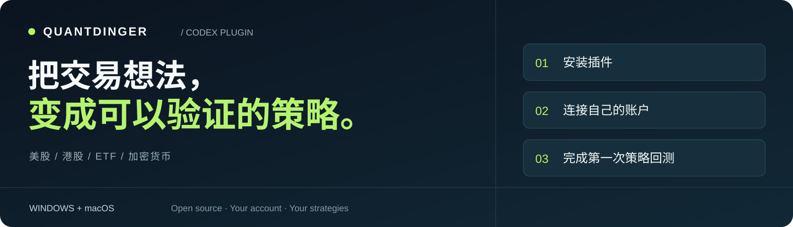
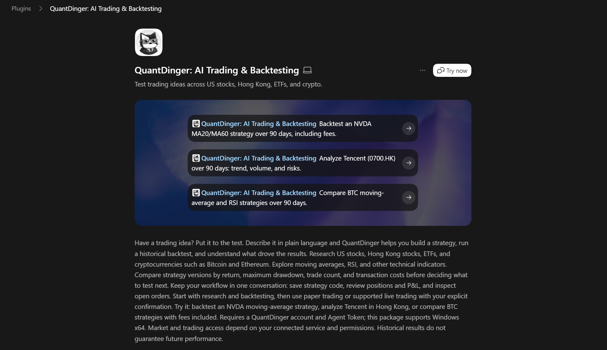

<p align="center"><a href="README.md">English</a> · <a href="README.zh-CN.md">简体中文</a> · <a href="https://ai.quantdinger.com">打开 QuantDinger ↗</a></p>



<p align="center">
  <a href="https://github.com/OpenByteInc/quantdinger-codex-plugin/actions/workflows/validate.yml"></a>
  <a href="LICENSE"></a>
  
  
</p>

**说出交易想法，写成策略，再让历史数据检验。**

研究**美股、港股、ETF 和加密货币**，编写策略、保存回测、查看账户——连接自己的 QuantDinger，在一个 Codex 对话中完成。

**[安装插件](#1-安装插件)** · **[连接账户](#2-连接自己的账户)** · **[第一次回测](#3-完成第一次回测)** · **[详细教程](docs/INSTALL.zh-CN.md)**

## 1. 安装插件

准备支持插件的 Codex 客户端、Git，以及可以运行 `codex --version` 的终端。如果找不到命令，请先安装 [Codex CLI](https://developers.openai.com/codex/cli)。按电脑系统**选择一种**安装：

### Windows · 打开 PowerShell

```powershell
codex plugin marketplace add OpenByteInc/quantdinger-codex-plugin
codex plugin add quantdinger@quantdinger
```

支持 Windows 10/11 x64，已内置 Python 和依赖，首次启动在本机校验并解压。**不用自己安装 Python。**

### Mac · 打开“终端”

先用 [uv 官方安装器](https://docs.astral.sh/uv/getting-started/installation/)安装 `uv`，已有则跳过：

```bash
curl -LsSf https://astral.sh/uv/install.sh | sh
```

然后安装 Mac 插件：

```bash
codex plugin marketplace add OpenByteInc/quantdinger-codex-plugin
codex plugin add quantdinger-macos@quantdinger
```

Mac 启动器支持 Apple Silicon 和 Intel 运行环境，使用的 Codex 客户端也需要支持对应电脑。首次启动会下载独立 Python 3.13 和经过哈希锁定的依赖，**请保持联网并等待初始化完成**。后续启动复用环境。

> **装好了？** 新建一个 **Codex 任务**，输入 `@`，选择 **QuantDinger**（Windows）或 **QuantDinger for Mac**。也可以打开详情，点击 **“立即试用 / Try now”**。



<sub>维护者提供的真实 Windows 截图。点击右上角 Try now，或选择一个示例开始。截图拍摄于 0.2.0 缩短标题、增加 Mac 入口之前；不同 Codex 版本的布局和文字可能略有不同。</sub>

## 2. 连接自己的账户

1. 登录 [QuantDinger](https://ai.quantdinger.com)。
2. 打开 **[个人中心 → Agent Token](https://ai.quantdinger.com/#/profile?tab=agentTokens)**，创建权限适当的 Token，初次测试建议仅限模拟交易。
3. 在启用插件的任务中发送：**“帮我连接 QuantDinger 账户，并确认我的权限。不要下单。”**
4. 按提示提供 Token，核对返回的**服务地址、权限和是否仅限模拟交易**。

**成功标志：** 返回 `connected`，账户和权限已验证。随后可以直接在同一对话中继续，连接账户不会启动交易。

Mac 首次使用可能弹出钥匙串访问提示，请确认请求来自刚安装的 QuantDinger 运行环境。Token 的本地副本保存到系统凭据库；在聊天中输入的 Token 也会进入对话和工具历史。不希望这样保存，可以使用[终端隐藏输入](docs/INSTALL.zh-CN.md#不在聊天中输入-token)。

## 3. 完成第一次回测

复制下面这段到同一个任务：

```text
为 NVDA 编写 MA20/MA60 均线交叉策略，回测最近 90 天。
初始资金 10,000，手续费 0.1%，滑点 0.05%。
保存结果，返回 runId、实际数据日期、收益率、最大回撤、
完整交易数量和未平仓仓位。
不要部署策略，也不要开始交易。
```

Codex 会检查并保存策略、提交回测、等待完成，再解释结果。返回的 **`runId`** 对应 QuantDinger 的标准回测记录。解读时一起检查实际日期、成本、完整交易和剩余持仓；某些行情区间没有完整平仓交易，也可能是正常结果。

| 下一步想探索什么 | 可以直接这样问 |
| --- | --- |
| **港股 · 腾讯** | 分析 0700.HK 最近 90 天的趋势、成交量和历史回撤，注明数据日期。 |
| **ETF · SPY** | 在相同日期、资金、手续费和滑点设置下，对比均线策略与 RSI 策略。 |
| **加密货币 · BTC/USDT** | 回测带趋势过滤、RSI 入场、2% 止损、3% 止盈和最长持仓时间的策略，检查完整交易。 |
| **账户 · 只读查看** | 查看我的模拟账户持仓、策略成交和挂单，解释异常，不修改任何状态。 |

## 从市场研究到交易运行

| 研究市场 | 编写与验证 | 监控与操作 |
| --- | --- | --- |
| 标的搜索、报价、历史 K 线 | Strategy API V2 策略编写 | 账户与策略持仓 |
| 成交量、因子、标的池 | 编译检查、源码版本管理 | 成交、挂单、运行状态 |
| 美股 / 港股 / ETF / Crypto | 保存回测、比较交易成本 | 在授权范围内明确确认操作 |

```text
你的 Codex → 本地 QuantDinger 插件 → 你的 QuantDinger 后端
```

**[完整安装、自托管、更新与排错教程 →](docs/INSTALL.zh-CN.md)** · **[反馈问题 →](https://github.com/OpenByteInc/quantdinger-codex-plugin/issues)**

<details>
<summary>费用、数据与权限说明</summary>

- 插件源码开源，QuantDinger 云端操作可能按当前价格扣除积分；Codex 使用费用另行计算。
- 助手利用工具完成研究，当前版本没有单独暴露原生 AI 投研报告生成工具。
- 为减少时区和数据源末日数据未就绪造成的失败，历史数据可能有意排除最近一天，请以实际返回日期为准。
- 实际市场和操作能力由后端与账户权限决定，连接账户不代表授权交易。
- 卸载插件不会停止后端策略或撤销 Token。
- 本仓库是独立 GitHub 市场源，不代表已上架 OpenAI 官方公共目录或获得其背书。历史回测不保证未来收益。详见[安全与数据处理](SECURITY.md)。

</details>

---

[构建与测试](BUILDING.md) · [参与贡献](CONTRIBUTING.md) · [更新记录](CHANGELOG.md) · [Apache-2.0](LICENSE) · [第三方声明](NOTICE) · [后端与 MCP 源码](https://github.com/OpenByteInc/QuantDinger)
